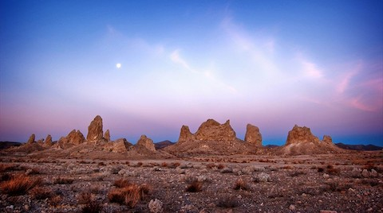

---
title:
author: "cjlortie"
date: "2018"
output:
  html_document:
    theme: flatly
    toc: yes
    toc_depth: 3
    toc_float: yes
  pdf_document:
    toc: yes
---
<br>  

###California Desert Ecology  
<br>  



[ecoblender](http://ecoblender.org)  
<br>  

An exploration of research within the region across all desert sites.

**Purpose**  
To contrast the ecology and examine larger-scale, regional gradients.

**Concepts**  
1. Local versus regional drivers of change.  
2. Biodiversity versus environmental drivers and relative variance patterns.  
3. Strength of interactions.  

###Site data  
A quick set of data to describe sites.
```{r, data, warning=FALSE, message=FALSE}
library(tidyverse)
sites <- read_csv("data/regional_sites.csv")
sites <- sites %>%
  rename(aridity = aridity.demartonne.annual)

```

###Viz
```{r, maps, warning=FALSE, message=FALSE}
#maps####
library(ggmap)
cali <- get_map(location = c(lon = -119.625, lat = 35.12), zoom = 5)
p <-ggmap(cali)

p + 
  geom_point(data=sites, aes(x=long, y=lat), alpha = .5, size = 2) + 
  labs(x = "longitude", y = "latitude")

cali <- get_map(location = c(lon = -119.625, lat = 35.12), zoom = 6)
p <-ggmap(cali)
p + 
  geom_point(data=sites, aes(x=long, y=lat), alpha = .5, size = 1) + 
  labs(x = "longitude", y = "latitude") +
  theme(axis.text.x = element_text(size=4), axis.text.y = element_text(size=4)) +
  facet_wrap(~site)
  
#aridity####
ggplot(sites, aes(site, aridity)) +
  geom_boxplot() +
  labs(x = "sets of sites", y = "aridity index")

ggplot(sites, aes(site, MAP)) +
  geom_boxplot() + 
  labs(x = "sets of sites", y = "mean annual precipitation (mm)")

ggplot(sites, aes(lat, aridity)) +
  geom_point(aes(color = MAP)) +
  labs(x = "latitude", y = "aridity index", color = "map (mm)")

```

###Models
```{r, models, warning=FALSE, message=FALSE}
#differences between regions but exclude Tejon
sites <- sites %>%
  filter(site != "San Joaquin")

m <- glm(aridity~site, sites, family = "gaussian")
summary(m)
anova(m, test = "Chisq")

#simple latitude driver
m <- glm(aridity~lat, sites, family = "gaussian")
#m <- lm(aridity~lat, sites)
summary(m)
anova(m, test = "Chisq")

#m <- glm(MAP~lat, sites, family = "gaussian")
m <- lm(aridity~lat, sites)
summary(m)
#anova(m, test = "Chisq")

```
